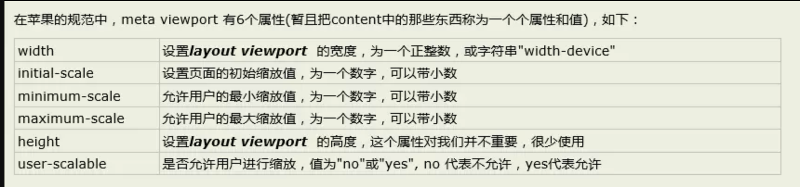
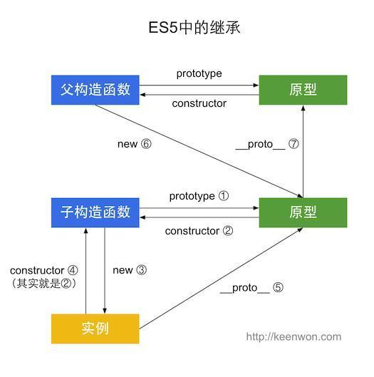
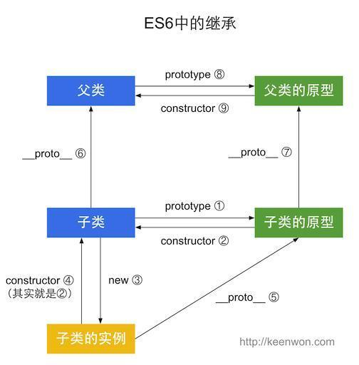

## box-shadow
最多可写8组
基本语法是{box-shadow:[inset]     x-offset     y-offset     blur-radius     spread-radius    color}
x-offset  必填 
y-offset  必填
其他可选  一般都是  x-offset     y-offset      blur-radius      color   
对象选择器 {box-shadow:[投影方式]   X轴偏移量   Y轴偏移量   阴影模糊半径   阴影扩展半径    阴影颜色}
白话文：模糊度        放大或者缩小阴影，可以为负值（ －   ＋ ）
box-shadow: 
          #159AF3 65px -15px 0 -5px, 
          #159AF3 25px -25px, 
          #159AF3 30px 10px, 
          #159AF3 60px 15px 0 -10px, 
           #159AF3 85px 5px 0 -5p；

## border-radius
值：百分比( % )    px
border-radius: 四个值时代表 1em 2em .5em 1em;
border-top-left-radius: 1em;
border-top-right-radius: 2em;
border-bottom-right-radius: 0.5em;
border-bottom-left-radius: 1em;
不管写几个值，都是上面四个组成的，如果没有就与对边的想等   没有bottom 就和top想等。。。。。

border-radius: 2em 1em 4em / 0.5em 3em;  分解为
border-top-left-radius: 2em 0.5em;
border-top-right-radius: 1em 3em;
border-bottom-right-radius: 4em 0.5em;
border-bottom-left-radius: 1em 3em;

## rgba代表的意思
rgb 表示的是颜色    0～255的值
a     表示的是透明度
rgb(红，绿，蓝）
红（255，0，0）
绿（0，255，0）
蓝（0，0，255）

高级一点的可以用hsl
HSL 指的是 hue（色调）、saturation（饱和度）、lightness（亮度） - 表示颜色柱面坐标表示法。
HSL 颜色值是这样规定的：hsl(hue, saturation, lightness)。
Hue 是色盘上的度数（从 0 到 360） - 0 (或 360) 是红色，120 是绿色，240 是蓝色。Saturation 是百分比值；0% 意味着灰色，而 100% 是全彩。Lightness 同样是百分比值；0% 是黑色，100% 是白色。
hola       增加了一个透明度


## animation
animation: name duration timing-function delay iteration-count direction fill-mode;
name:名称   与keyfram 对应
duration: 动画运行的时间
timing-function:  速度曲线  默认ease
delay:   延迟
iteration-count ：播放次数   默认1次  无限次 infinite
direction： 是否需要逆向行驶   默认normal   alternate 动画轮流反向播放
state:     动画是否运行货停止，  一般不选择
fill-mode:   对象动画时间之外的状态  默认none   forwards动画完成后保持最后一个属性

## transform
可以跟：translate   rotate   scale     skew
在2D转换中上面四个值都有X － Y 两个方向     写法：translate( X , Y )   或者translateX

transform-origin   改变转换元素的位置
transform-origin:  x-axis y-axis z-axis;
定于试图被至于何处：top      length     ％    三种值的类型

transform-style   规定如何在3D空间中呈现被嵌套的元素
                            flat
                            preserve-3d  子元素保留3d位置
perspective  规定3D元素的透视效果    px值   相当于景深   （一旦使用了这个属性，三轴坐标就启用了）
perspective-origin  规定3D元素的底部位置

backface-visibility  规定元素不面向屏幕背面是否可见   hidden  不可见   visibility  可以见 
    

## transition  效果过渡
四个值   type   time    fun     delay
            width    2s     ease     1s


## css3  
appearance    看上去像什么
appearance:button   看上去像个按钮

-webkit-font-smoothing: antialiased; 让字体变的平滑

css3运动的链式运动  transitionend
 函数用事件绑定去做 
     例如 obj.addEventListener('transitionend',function(){},false)

transition 的用法新解
transition:background-color 1s ease, margin-top 1s ease;
transition: all 450ms cubic-bezier(0.23, 1, 0.32, 1)   0ms;还可以带延迟执行0ms表示延迟

省略号的用法
一行省略
              width:200px;
              overflow:hidden;
              text-overflow:ellipsis;
              white-space:nowrap;
指定行数省略
width: 300px;
word-break:break-all;  
 //在恰当的断字点进行换行  normal-浏览器默认位置换行，break-all —允许在单词内换行  keep-all — 只能在半角空格或连字符处换行，为了兼容，可以考虑word-wrap: break-word;
display:-webkit-box;  弹性盒子模型
-webkit-line-clamp:4;  -webkit-的私有属性，需要和上面和下面的属性配合使用，不可以缺少， 只要内核是-webkit-就支持
-webkit-box-orient:vertical;弹性盒子子元素的排列，竖直排列
overflow:hidden;
        


white-space 属性设置如何处理元素内的空白
normal默认。空白会被浏览器忽略。
nowrap文本不会换行，文本会在在同一行上继续，直到遇到 br 标签为止。 

word-wrap 属性用来标明是否允许浏览器在单词内进行断句
normal: 只在允许的断字点换行(浏览器保持默认处理) 
break-word:在长单词或URL地址内部进行换行，


word-break 属性用来标明怎么样进行单词内的断句
normal：使用浏览器默认的换行规则
break-all:允许在单词内换行
keep-all:只能在半角空格或连字符处换行

全屏
document.body.webkitRequestFullScreen(); 执行全屏
document.webkitCancelFullScreen(); 取消全屏

## BFC-格式化上下文
BFC (Box、Formatting Context)：是web页面中盒子模型布局的渲染模式，一个独立的渲染区域，不受外界影响，也不会影响外界
形成条件：
    1）浮动元素，float除none以外的值
    2）定位元素，absolute，fixed
    3）display：inline-block，table-cell
    4）overflow除了visible意外的值（auto，hidden，scroll）


flexible.js一个处理pc + 移动端适配的东西


解决：
1、float造成父元素的高度塌陷，给父元素增加oveflow：hidden可解决
2、margin-bottom和margin-top会在纵向重叠，以较大为主，可以在其中的一个父元素上增加overflow:hidden
```
  <div class="green">11</div>
  <div class="con">
      <div class="red">123</div>
  </div>
```
green和red盒子有margin的重叠，解决只需要给con增加overflow:hidden
3、一个盒子中第一个子元素用了margin-top时，父元素会跟着下来，始终和第一个子元素挨着，只需要给父元素增加一个overflow:hidden

布局的几种方法：
float + BFC等效果
tabel + table-cell
Flex
Grid
后两者是未来？？？

### 1、移动端viewport（网页适配各种分辨率）



<meta name="viewport" content="width=device-width, initial-scale=1.0, maximum-scale=1.0, user-scalable=0”>
大部分手机浏览器的默认宽度大多是980px
    1）影响css中px的因素，一般来讲1px就代表着屏幕的一个物理像素，但不是所有的，例如iphone4之后就推出了retain屏幕，分辨率提高到了640*960（320 * 480），但是尺寸却没有变化，这也就意味着相同大小的px在iphone中就代表了更多（2px）


    2）图：
    不同分辨率下会选择不同的图片倍数
     /*    
    为普通屏幕使用 pic-1.jpg，    
    为高分屏使用 pic-2.jpg，    
    如果更高的分辨率则使用 pic-3.jpg，比如印刷    
    */    
    background-image: image-set(
            url(../images/pic-1.jpg) 1x,            
            url(../images/pic-2.jpg) 2x,            
            url(../images/pic-3.jpg) 600dpi        
    );
    3）媒体查询
        @media screen
        @media all
        @media print
        Js查询：
    var isWideScreen = matchMedia("(min-width: 960px)"); 
    console.log(isWideScreen.matches); //是否匹配 true | false 
    console.log(isWideScreen.media); //"(min-width: 960px)"

    4）em
        作为字体大小的时候，相对于父元素的大小
        作为行高单位的时候，是相对于自身的大小
    5）vw和vh
        Vw是视口宽度的1/100
        Vh是视口高度的1/100
### 2、REM布局
rem的本质其实就是等比缩放，


### 3、关于移动端适配的问题
+ 1）设置根的字体大小，然后将尺寸转化为rem去显示，当然不能做到无限大，需要设置临界值，分辨率在某个位置的时候就fontSize不在变化，可以直接访问pc页面了
注意：网易和淘宝的做法是字体的大小用媒体查询去写px，不需要用rem

+ 1.1 设计稿比较简单，例如列表，可以直接使用弹性盒子布局，使用px作为单位，避免使用rem增加复杂的程度

+ 1.2 网易的做法
通过js设置html的fontSize大小，以640px的分辨率为例
document.documentElement.style.fontSize = document.documentElement.clientWidth / 6.4 + 'px';
或者是750分辨率，除以7.5或者75
Css的尺寸为设计稿的尺寸除以100即得到需要的尺寸
前提是：<meta name="viewport" content="initial-scale=1,maximum-scale=1, minimum-scale=1">

临界值的情况：
var deviceWidth = document.documentElement.clientWidth;
if(deviceWidth > 640) deviceWidth = 640;
document.documentElement.style.fontSize = deviceWidth / 6.4 + 'px';

+ 1.3、淘宝的做法
通过js，和网易类似，只是meta需要用device-width，所以需要计算这个尺寸
Device-width = 设备的物理分辨率 / (devicePixelRatio * scale)，一般这个devicePixelRatio， scale=1都是已经知道的,目前高清屏幕devicePixelRatio = 2，不过也有高的，例如2.5，3的。
var scale = 1 / devicePixelRatio;
document.querySelector('meta[name="viewport"]').setAttribute('content','initial-scale=' + scale + ', maximum-scale=' + scale + ', minimum-scale=' + scale + ', user-scalable=no');


document.documentElement.style.fontSize = document.documentElement.clientWidth / 10 + 'px';
得到上述公式。

布局时的尺寸=设计稿的尺寸/（设计稿分辨率/10），例如 75px的css尺寸 = 75 / 750 / 10 = 1rem，也需要设置临界值 ******优先算括号里面的
以上可以用一个js来表达lib-flexble


## 1、盒子模型
块元素，行内标签等
Margin
padding
border
Box-shadow
Border-sizing: border-box，提现了浏览器对盒子模型的兼容性，边框是否包含在width里面

## 2、垂直居中的方式
1、父position: relative，子absolute百分之50，在translate -50%
2、vertical-align: middle， 条件是display: inline-block;通常用在表格的td中，其次就是相邻的行内元素的对齐方式居中，例如A和B，A加了vertical-align: middle，那么B的基础线就在A的中间位置
3、display: flex; align-items: center; justify-content: center;
4、父：display: tabel, 子：display: table-cell， vertical-align: middle
5、子元素纯文本，可以使用line-height , 数值是父元素的高度

## 3、选择器的权重计算
ID > class > 标签 > * > [type]属性 > :hover伪类 > ::before伪元素 > 相邻选择器


## 4、清楚浮动的方法
1、额外标签法则：在最后一个浮动标签后，增加一个标签，给其值设置为clear: both
2、通过出发BFC，实现清除浮动，即给父元素添加overflow: hidden；缺点是元素如果超出后会被隐藏
3、使用:after伪元素清楚浮动
    .clearfix:after{/*伪元素是行内元素 正常浏览器清除浮动方法*/
        content: "";
        display: block;
        height: 0;
        clear:both;
        visibility: hidden;
    }
    .clearfix{
        *zoom: 1;/*ie6清除浮动的方式 *号只有IE6-IE7执行，其他浏览器不执行*/
    }

:after 和::after
二者都是伪元素，都可以在元素之后添加内容
不同点是前者是css3的写法，后者是css3的写法，用于区分:hover等选择器


## 5、BFC（block formatting context）块格式化上下文
它是页面中的一块渲染的区域，决定了内部元素的排列方式
触发的条件：overflow的值不为none，position的值为absolute或者fixed， float的值不为none，display的值为inline-block，table-cell
作用：它是一个独立的容器，与外界毫无关系，可以阻止元素被浮动元素覆盖，可以清楚浮动

## 6、实现自适应的正方形
vw = 视口宽度的1%
vh = 视口高度的1%
1、width: 50%; height: 50vh; background: red;
2、width: 50%; paddingBottom: 50%;height: 0;否则容易高度溢出


## 7、深克隆 浅克隆
1、JSON.parse( JSON.stringify(str))， 不能拷贝时间类型，正则等数据
2、浅克隆object.assign(), 扩展运算符


## 8、防抖函数和节流函数
起因：需要绑定一些持续触发的事件，例如resize，scroll， mousemove等，但也不希望频繁的处罚函数，所以用到这两个函数

防抖：触发事件n秒内，函数只执行一次（多次处罚后在执行一次，执行完后重新设定周期）
节流：连续触发事件，但在n秒内只执行一次函数（周期性的只执行一次）

## 9、数组去重
1、new Set 
使用方法为[…new Set(arr)]
2、双for循环，splice去重复
```
    function unique(arr){            
        for(var i=0; i<arr.length; i++){
            for(var j=i+1; j<arr.length; j++){
                if(arr[i]==arr[j]){         //第一个等同于第二个，splice方法删除第二个
                    arr.splice(j,1);
                    j--;
                }
            }
        }
        return arr;
    }
```
2、利用indexOf
```
function unique(arr) {
    if (!Array.isArray(arr)) {
        console.log('type error!')
        return
    }
    var array = [];
    for (var i = 0; i < arr.length; i++) {
        if (array .indexOf(arr[i]) === -1) {
            array .push(arr[i])
        }
    }
    return array;
}
```
3、利用sort排序，然后for循环遍历相邻两元素是否相等去重
4、利用对象属性不能相同去重


## 10、继承
考虑到了原形的问题，首先Object，Array，Function，Person即是对象也是构造函数，所以这些的__proto__属性均指向Function.prototype
而Function.prototype, Array.prototype, Person.prototype的__proto__指向Object.prototype, 顶层Object.prototype指向null

继承的方法
1）通过prototype继承属性，通过给父元素增加prototype.属性或方法名称，在给子元素的prototype = 父元素的实例，在实例子元素调用父元素
缺点：实例对象是被引用的，也就是父，子同使用一个对象（可以是数组或者json）

2）借用构造函数实现，在子构造函数中通过 构造函数.call(this)

3）组合，同时使用1和2的方法

es6的继承主要是通过class，用extends关键字来实现
```
class Colorpoint extends Point {
    constructor(x,y,color){
        super(x,y); //调用父类的constructor(x,y)
        this.color = color
    }
    toString(){
        //调用父类的方法
        return this.color + ' ' + super.toString(); 
    }
}
```
子类必须在constructor方法中调用super方法，否则新建实例时会报错。这是因为子类没有自己的this对象，而是继承父类的this对象，然后对其进行加工，如果不调用super方法，子类就得不到this对象。因此，只有调用super之后，才可以使用this关键字


## 11、apply、call、bind
都是改变this指向的
当我们使用一个函数需要改变this指向的时候才会用到call`apply`bind

如果你要传递的参数不多，则可以使用fn.call(thisObj, arg1, arg2 ...)如果你要传递的参数很多，则可以用数组将参数整理好调用fn.apply(thisObj, [arg1, arg2 …])

如果你想生成一个新的函数长期绑定某个函数给某个对象使用，则可以使用const newFn = fn.bind(thisObj); newFn(arg1, arg2...)


手写call
```
Function.prototype.call = function(context) {
    const ctx = context || window;
    // 将当前被调用的方法定义在ctx.func上
    ctx.fuc = this;
    // 获取实参
    const args = Array.from(arguments).slice(1);
    // 以对象调用的形式调用func，此时this指向ctx，也就是传入的需要绑定的this指向
    const res = arguments.length > 1 ? ctx.func(…args) : ctx.func();
    // 删除该方法，不然会对传入的对象造成污染
    delete ctx.func;
    Return res
}
```
apply和call的区别主要是在穿参数上，apply传入的是数组，call是一个接一个参数，所以手写apply可以省略args的那一步，更改如下
```
Const res = arguments[1] ? Ctx.func(…arguments[1]) : ctx.func()
```
bind是返回绑定this的函数，所以更改返回值就可以，如下
```
Return function() {
    // 需要对bind函数的实参和返回的绑定函数的实参进行参数合并，调用时传入
    const allArgs = args.concat(Array.from(arguments))
    return allArgs.length > 0 ? ctx.func(…allArgs) : ctx.func()
}
```

## 12、sleep函数
其实就是结合其他语言实现sleep，具体如下
```
function sleep (time) {
    return new Promise(resolve => setTimeout(resolve, time)
}
```

## 13、lazyMan
实际考察的是闭包，链式调用，事件轮询机制，队列
```
        class _lazyman {
            constructor(name) {
                this.task = [];
                const task = () => {
                    console.log('Hi' + name)
                    this.next()
                }
                this.task.push(task)
                setTimeout(() => {
                    this.next()
                }, 0)
            }
            next() {
                const current = this.task.shift();
                current && current()
            }
            sleep(time) {
                this._sleepWrapper(1, false);
                return this
            }
            _sleepWrapper(time, first) {
            const task = () => {
              setTimeout(() => {
                console.log(`Wake up after ${time}`);
                this.next();
              }, time * 1000)
            }
            if (first) {
              this.task.unshift(task);     // 放到任务队列顶部
            } else {
              this.task.push(task);        // 放到任务队列尾部
            }
          }

        }

        function lazyman(name) {
            return new _lazyman(name)
        }

        lazyman('jeremy').sleep(10)
// 重要的地方是需要this.next()的调用，因为执行完数组中的一个任务后需要接着执行第二个任务
```

## 14、jsonp的实现
起因是同源策略，解决就是跨域
jsonp通过script标签的src属性，通过callback的形式实现跨域的，确定是只能使用get请求


## 15、eventEmitter 发布/订阅模式


## 16、es5中的继承和es6种的继承图谱





## 17、 promise，generator，async区别
promise通过回掉解决异步编程的问题，.then来实现回掉
generator是将函数分步骤阻塞，只有主动调用next()才能进行下一步
async相当于自治性的generator函数，自带状态机，在await的部分等待返回，优于promise的地方就是不用链式回掉，直接写成同步


## 18、instanceof 
用于检测构造函数的prototype属性是否出现在某个实例对象的原型链中
object instanced constructor
也就是检测constructor.prototype是否存在object的原型链上
```
函数C，D， o=new C(); o instanced C; //true 因为Object.getPrototypeOf(o) === C.prototype
```

## 18、new原理
1、创建一个空对象
2、这个空对象的_proto_指向构造函数的prototype
3、将构造函数的this指针替换成对象，执行构造函数内部代码
4、返回一个新的对象
```
        function _new(fn) {
            return function() {
                var obj = {
                    __proto__: fn.prototype
                }
                fn.call(obj); //fn中的this替换成obj
                return obj
            }
        }
```

19、Array  原型链上的方法
1）Array.from 从一个类数组或可迭代对象创建一个新的，浅拷贝的数组实例
```
console.log(Array.from('foo'));
// expected output: Array ["f", "o", "o"]

console.log(Array.from([1, 2, 3], x => x + x));
// expected output: Array [2, 4, 6]
```
2）slice和splice的区别是后者常用语删除元素，前者用于截取数组
3）Array.isArray()，判断是不是为一个数组
4）arr.reduce 从左到右为数组中的每个元素执行一次提供的函数，将结果汇总返回单个值，可用于求和，
参数（执行方法，初始值）——应用数组的扁平化
执行方法（累计器累计回掉的返回值，数组中正在处理的元素，当前元素的索引，调用reduce的数组） 
```
初始值是作为第一次调用函数时的值
注意：如果提供初始值，那么累积器的返回值是初始值，正在处理的元素就是数组第一个元素，如果没有提供，那么累计器的返回值就是数组的第一个元素，正在处理的元素就是第二个元素

扁平化的方法：
.flat（depth）这个是层级，如果是[1,[2,3] => [1,2,3] 这个直接使用flat()
如果是[1,2,[3,4,[5,6]]],这种depth = 1

toString()，只适用于数组元素全部为数字的情况下(toString,join都可以将数组的中括号去掉)
Return arr.toString().split(',’).map(item => +item)
toString()会把数组变成字符串，去掉中括号的带逗号的字符串
+item只是隐士转换为数字类型

扩展运算符
原理是取出数字中的每一个值，利用while循环，如果遇到数组，则再次使用。。。
    let arr = [[1, 2, [3, 4], 5], [6, 7, 8], [[9, 10], 11]]
    function flat(arr) {
      while (arr.some(item => Array.isArray(item))) {
        arr = [].concat(...arr);
      }
      return arr;
    }
    console.log(flat(arr)); // [1, 2, 3, 4, 5, 6, 7, 8, 9, 10, 11]
arr.some是测试数组中是不是至少有一个元素通过了被提供的函数测试，返回的是一个布尔值
```

## 20、从输入ulr到页面呈现个经历了什么
1、DNS解析， 从.开始从后开始查找，返回ip地址
2、TCP的链接
三次握手四个挥手，此时只进行三次握手

3、发送http链接
4、服务器响应链接
5、浏览袭渲染页面
6、TCP断开链接

四次分手时因为TCP的通信协议，全双工模式，需要先双方确认没有数据要发送了，然后在发送fin报文，确认分手

## 21、http状态码
200：成功
3XX：重定向，表示客户端需要做额外的工作才能获取到需要的资源
400：客户端的问题
410：没有权限
404：地址不对
500：服务器的问题

## 22、web安全
xss：跨站脚本攻击
通过对网页注入可执行代码达到攻击的目的，可以获取联系人列表，发送虚假信息，删除用户日志等等

条件：
1、需要向web注入代码，2、这些代码能被成功执行
攻击方式：
反射型
存储型
csrf：跨站请求伪造

## 23、柯里化currying
就是把接受多个参数的函数变成接受一个单一参数的函数，并且返回接受余下参数而且返回结果的新函数的技术，是高阶函数的一种用法
```
function currying(fn,...args){
    if(fn.length <= args.length){
        return fn(...args)
    }
    return function(...args1){
        return currying(fn,...args,...args1)
    }
}
function add(a,b,c){
    return a + b + c
}
add(1,2,3) // 6
var curryingAdd = currying(add);
curryingAdd(1)(2)(3) // 6


Fn.length 表示的是形参个数
最红的目的是在fn.lenght === args.length是执行，其余的步骤都是在汇集参数的过程
```

## 24、Vue
## 24.1 watch和computed的区别
computed可以关联多个属性，当这些属性中的一个发出改变时才会重新渲染，否则直接从缓存中拿取。
watch是当数据变化时响应时，执行异步操作或者某些高性能的操作

## 24.2组件的通讯方式
1）props和$emit(传递的方法名, 可以传参数)， 如果要传e，请使用$event

2）兄弟组件之间传递值，采用event.$emit和event.$on
原理是新建一个事件中心来实现组件之间的传递值
首先最外层增加Event = new Event()
A组件和B组件
方法中可以Event.$emit(事件名，参数)
C组件获取A、B组件中的参数
方法中Event.$on(同上事件名，(参数) => {}) //需要写两个，因为A、B组件各命名了两个自定义事件名


## 24.3 Vue.nextTick
在下次 DOM 更新循环结束之后执行延迟回调。在修改数据之后立即使用这个方法，获取更新后的 DOM

说白了就是vue更新dom是异步的
//改变数据
vm.message = 'changed'

//想要立即使用更新后的DOM。这样不行，因为设置message后DOM还没有更新
console.log(vm.$el.textContent) // 并不会得到'changed'

//这样可以，nextTick里面的代码会在DOM更新后执行
Vue.nextTick(function(){
    console.log(vm.$el.textContent) //可以得到'changed'
})

// 用途，用于视图更新后，基于新的视图进行的操作
## 24.4 虚拟dom为什么这么快
1）虚拟dom是真实dom的类object的映射
2）虚拟dom频繁的修改，然后一次性对比并修改真实dom中需要修改的部分
3）真实dom重排和重绘效率低
4）虚拟dom有效降低大面积dom的重排和重绘


## 25、常见的数据结构
1、队列，先进先出
2、栈，先进后出
3、链表，有点像lazyman的链式结构，.next
4、集合，set结构
5、hash表，查找速度快，但是存储量需要手动扩展
6、树，考察二叉树
二叉树（二叉搜索书）：树叶中的节点最多两个子节点
指由以下特点的树
任意节点的左子树不空，则左子树上所有结点的值均小于它的根结点的值；
任意节点的右子树不空，则右子树上所有结点的值均大于它的根结点的值；
任意节点的左、右子树也分别为二叉查找树；
没有键值相等的节点。二叉查找树相比于其他数据结构的优势在于查找、插入的时间复杂度较低。为O(log n)。二叉查找树是基础性数据结构，用于构建更为抽象的数据结构，如集合、multiset、关联数组等
7、图，可以看成是有关联的树，可以使用邻接表来描述各个节点的关系


## 26、常见的算法
排序（冒泡排序，快速排序， 插入排序等）
冒泡排序的原理：使用双循环，进行两个位置的比较，然后互换位置
```
function bubbleSort(arr) {  
    for(let i = 0,l=arr.length;i<l-1;i++) {
        for(let j = i+1;j<l;j++) { 
          if(arr[i]>arr[j]) {
                let tem = arr[i];
                arr[i] = arr[j];
                arr[j] = tem;
            }
        }
    }
    return arr;
}

快速排序：

function quickSort(arr) {
 
    if(arr.length<=1) {
        return arr;
    }
    let leftArr = [];
    let rightArr = [];
    let q = arr[0];
    for(let i = 1,l=arr.length; i<l; i++) {
        if(arr[i]>q) {
            rightArr.push(arr[i]);
        }else{
            leftArr.push(arr[i]);
        }
    }
    return [].concat(quickSort(leftArr),[q],quickSort(rightArr));
}
``` 
## 27、常见的设计模式
模块模式（var person = 自执行函数，函数中返回对象）
构造函数模式： 通过new实例拿到内部定义的对象
混合模式，上述二者混合

单例模式：是确保一个类只有唯一的一个实例，一般用于全局缓存，比如window，采用闭包的形式
var single = (function(){
    let instance;

    function getInstance(){
　　　　// 如果该实例存在，则直接返回，否则就对其实例化
        if( instance=== undefined ){
            instance= new Construct();
        }
        return instance;
    }

    function Construct(){
        // ... 生成单例的构造函数的代码
    }

    return {
        getInstance : getInstance
    }
})();
工厂模式：

发布-订阅着模式（观察者模式）：定义了对象之间一对多的依赖关系，当一个对象的状态发生改变，所有依赖与它的对象都将得到通知
应用：DOM事件

## 28、websocket
我们一直使用的http协议只能由客户端发起，服务端无法直接进行推送，这就导致了如果服务端有持续的变化客户端想要获知就比较麻烦。WebSocket协议就是为了解决这个问题应运而生

推送的可以是文本也可以是数据


## 29、手写promise(简单版本)
```

function myPromise(excutor) {
    var that = this;
    that.state = 'pending';
    that.value = null;
    that.reason = null;
    that.onFulfilledArray = [];

    that.onRejectedArray = [];

    // 成功的回掉
    function resolve(value) {
    if (that.state === 'pending') {
            that.state = 'resolved';
            that.value = value
            that.onFulfilledArray.forEach(function (fn) {
                fn(that.value)
            })
        }
    }
    // 失败的回掉
    function reject(value) {
        if (that.state === 'pending') {
            that.state = 'rejected';
            that.reason = value
            that.onRejectedArray.forEach(function (fn) {
                fn(that.value)
            })
        }
    }
    try {
        excutor(resolve, reject)
    } catch (error) {
        reject(error)
    }
}

myPromise.prototype.then = function (onFulfilled, onRejected) {
    var self = this;
    var promise2 = new myPromise((resolve, reject) => {
        if (self.state === 'pending') {
            // 针对异步的条件
            self.onFulfilledArray.push(function () {
                var result = onFulfilled(self.value);
            })
            self.onRejectedArray.push(function () {
                var result = onRejected(self.reason);
            })
        }
        // 以下是同步
        if (self.state === 'resolved') {
            var result = onFulfilled(self.value)
        }
        if (self.state === 'rejected') {
            var result = onRejected(self.reason)
        }
    })
    return promise2

}
```

## 30、react中的fiber概念（简单理解）
fiber的出现主要是针对react在更新渲染阶段中的第一个部分，以往的更新操作分为：
1）reconciler 其实也就是虚拟dom树进行diff算法的对比，一旦进行就无法中断，如果有大量的计算就会一直占用主线程，导致交互和动画出现卡顿现象
2）render 其实就是把diff算完的element放到任务队列里，然后去更新dom

fiber就是针对第一阶段革命的，它把这一阶段分为很多小的单元，可以进行暂停等操作，在合适的机会在进行调用（可以称的上是一个调度中心）

## 31、CORS（跨域资源共享）
是一种机制，它使用额外的http头来告诉浏览器，让运行在一个origin上的web应用被允许访问来自不同源服务器上的指定资源，从而使跨域数据的传输得以安全进行
```
其实就是origin的判断
服务器中可以增加头部Access-Control-Allow-Origin: ‘*'
*表明该资源可以被任意访问
返回头中可能包含
Access-Control-Allow-Method
Access-Control-Allow-Headers
Access-Control-Allow-Credentials: true(false) 表明是否允许发送cookie（身份验证）

请求头origin
预检请求可能会携带一下字段
Access-Control-Request-Method  预请求的方法
Access-Control-Request-Headers 预请求中需要携带的其他的头部字段

```

