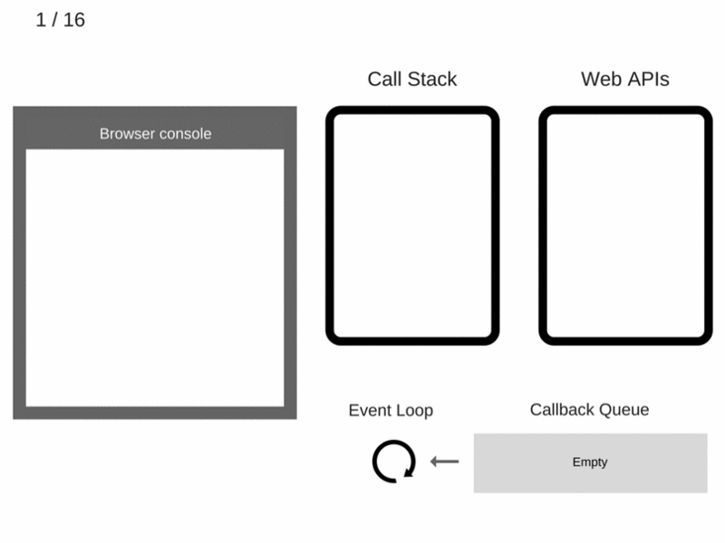
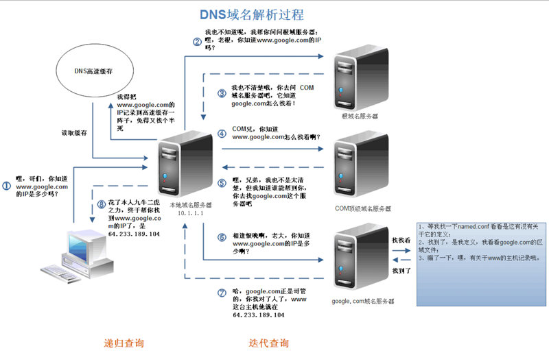

## SEO 搜索引擎的优化

是对网站的优化：例如 meta 标签加关键词，增加 descript 描述，Robots(告诉搜索引擎搜索哪些页面)等，还有 titile，加快首页的渲染，例如可以利用 ssr
正文 h1 等合理出现，锚文字的合理安排，图片的 alt 等 链接尽量采用 a 标签，这个更容易使 spider 解析。
做好 404 页面
少用 iframe。蜘蛛不会爬取其中的内容
保持内容的更新

百度站长里面提交自己的链接，里面有一些方法可以加快 spider 的爬取

http 请求，也就是浏览器发起请求到渲染的过程如下：
DNS 解析
TCP 连接
发送 HTTP 请求
服务器处理并返回 HTTP 抱文
浏览器解析渲染页面
连接结束

## web 的攻击方式 csrf xss

Xss：cross-site script 跨站脚本攻击
主要是通过 html 标签注入，篡改网页，插入恶意的脚本，前端可能没有经过严格的校验直接就进到数据库，数据库又通过前端程序又回显到浏览器

防御：对用户输入的信息进行过滤，正则过滤，并且后端也要进行防御

Csrf：cross-site request forgery 跨站请求伪造
CSRF 也是一种网络攻击方式，比起 xss 攻击，是另外一种更具危险性的攻击方式，xss 是站点用户进行攻击，而 csrf 是通过伪装成站点用户进行攻击，而且防范的资源也少，难以防范

防御：验证 http referer 字段，判断网址是不是同源，相符就合法，不合法就拒绝请求
或者在请求头中加入 token 字段，例如 JWT 字符串

## 1、js 中闭包的概念

当一个内部函数被其外部函数之外的变量引用时，就形成了一个闭包。
能够访问自由变量的函数，
能够读取其他函数内部变量的函数，函数没有被释放，整条作用域链上的局部变量都将得到保留
闭包可以用在许多地方。它的最大用处有两个，一个是前面提到的可以读取函数内部的变量，另一个就是让这些变量的值始终保持在内存中
函数内部可以访问全局变量，这是 js 语言的特殊之处

## 阿里：

1、主流移动浏览器的特点，主流移动端框架（Zepto）
2、react native
3、web 端安全
3、node 知识， koa async 模块的原理
5、Canvas/webGL/Css3 等动画

## 1、JS 如何处理同步和异步的情况

JS 是只有一个调用堆栈的单线程编程语言，但它也可以使用一个称为 eventloop 的机制来处理一些异步的函数
调用堆栈是定位函数的位置。一旦函数被调用，函数将被推入堆栈。然而，异步函数不会立即被推入调用堆栈，而是会被推入任务队列(Task Queue)，并在调用堆栈为空后执行。将事件从任务队列传输到调用堆栈称为事件循环

##2、JS 事件机制

- A、事件绑定： (在事件冒泡中运行，this 指向当前元素)
  DOM 上直接绑定 onClick
  JS 里面 document.querySelector(div).onClick = function() {}
- B、事件监听：addEventListener attachEventListener
  element.addEventListener(event, function, useCapture)
  　 event : （必需）事件名，支持所有 DOM 事件 。
  　 function：（必需）指定要事件触发时执行的函数。
  　 useCapture：（可选）指定事件是否在捕获或冒泡阶段执行。true，捕获。false，冒泡。默认 fals
  （同一个事件处理函数可以绑定 2 次，一次冒泡,一次捕获；相同的事件处理函数可以绑定多次，并且顺序执行）
- C、事件委托：利用冒泡的原理，将事件加到父元素身上

- D、事件的执行顺序：捕获阶段—目标阶段— 冒泡阶段
  阻止事件冒泡：e.stopPropagation
  阻止默认行为：e.preventDefault

## 事件循环



- 3、任务，微任务
  任务按照顺序执行，微任务可能在不同的浏览器，统一浏览器的不同版本中有不同的顺序，但不管是微任务还是任务都在按照顺序执行，例如微任务

```
setTimeout 和 promise 有的浏览器是setTimeout在前promise在后，有的则是相反，但是在谷歌中，正确的微任务promise先执行
微任务包含Mutation、observer、promise
setTimeout 以及事件列为任务

宏任务：
同步任务，setTimeout, setInterval,
微任务：
Promise, promise.then, observer,MutaionObserve, process.nextTick node环境


  const promise = new Promise((resolve, reject) => {
    console.log(1);
    resolve('22222');
    console.log(2);
    setTimeout(() => {
      console.log(7)
    })
  }).then((res)=>{
    console.log('1111')
    console.log(res)
  });

    promise.then(() => {
    console.log(3);
    setTimeout(() => {
      console.log(6);
    })
  })
  setTimeout(() => {
    console.log(5);
  })
  console.log(4);

// 1，2，4， 111， 22222，3，7，5，6
```

- 4、普通函数和箭头函数中 this 的指向问题

普通函数中的 this 要看是谁在调用，如果是匿名函数（this 指向 window），赋予对象后调用，指向对象 object

```
Const obj = {
    Name: ‘jeremy’,
    Sum: function() {
        console.log(this)
    }
}
Obj.sum() ==> this === obj

Func = obj.sum
Func() ==> this === window
```

箭头函数 this 是在定义的时候绑定的，不是在运行过程中绑定的

```
上面的例子改为
Sum: () => { console.log(this)}
Func = obj.sum
Func() ==> this === obj
```

## 内存泄漏

内存溢出：程序向系统申请一定大小的内存，而系统不能满足程序的要求就是内存溢出
泄漏：申请的内存一直得不到释放，垃圾回收机制回收不了，越积越多，最终倒是内存泄漏

## 垃圾回收机制的方法：

    引用计数：引用次数为0，就删除（低版本的ie采用）
    标记清除：大部分浏览器以此方式进行垃圾回收，当变量进入执行环境（函数中声明变量）的时候，垃圾回收器将其标记为“进入环境”，当变量离开环境的时候（函数执行结束）将其标记为“离开环境”，在离开环境之后还有的变量则是需要被删除的变量。标记方式不定，可以是某个特殊位的反转或维护一个列表等

常见的 js 内存泄漏：意外的全局变量， 定时器遗忘， 闭包，DOM 之外的引用
根据泄漏的原因针对处理，例如降低意外全局变量的创建，定时器及时清理，生产环境去掉 console.log

## ajax 原理

实现的与原理是一个很重要的 XMLHttpRequest 对象

```
const xml = new XMLHttpRequest()
    xml.open('GET','http://127.0.0.1:8000/blog/example', true) // true表示是否异步

    xml.onreadystatechange = function () {。// 设置回掉函数
      if (xml.readyState === 4) {
        if (xml.status === 200) {
          console.log(JSON.parse(xml.responseText))
        }
      }
    }
    xml.send(null) // 发送请求

下面是封装
function ajax(option){
    //用户配置option 默认配置init
    var init = {
        type:'get',
        async:true,
        url:'',
        success: function () { },
        error: function () { },
        data:{},
        beforeSend: function () {
            console.log('发送前...');
            return false;
        }
    };
    //TODO step1: 合并参数
    for(k in option){
        init[k] = option[k];
    }
    //TODO step2: 参数转换
    var params = '';
    for(k in init.data){
        params += '&'+k+'='+init.data[k];
    }
    var xhr = new XMLHttpRequest();
    // type url
    //TODO step3: 区分get和post,进行传参
    var url = init.url+'?__='+new Date().getTime();
    //TODO step4: 发送前
    var flag = init.beforeSend();
    if(!flag){
        return;
    }
    if(init.type.toLowerCase() == 'get'){
        url += params;
        xhr.open(init.type,url,init.async);
        xhr.send();
    }else{
        xhr.open(init.type,url,init.async);
      xhr.setRequestHeader('content-type','application/x-www-form-urlencoded');
        xhr.send(params.substr(1));
    }
    xhr.onreadystatechange = function () {
        if(xhr.readyState == 4){
            if(xhr.status == 200){
                init.success(xhr.responseText);
            }else{
                //error
                init.error();
            }
        }
    }
}
```

最主要的属性就是 onreadystatechange readyState status responseText
readyState
0: 创建对象
1: 初始化对象 xml，准备发送
2: 发送请求，但没有收到服务器的反馈
3: 浏览器接收请求，但还没有完成
4: 接收完毕

## 负载均衡

    当系统面临大量用户访问，负载过高时，通常会使用增加服务器的数量来进行横向扩展，使用集群和负载均衡提高整个系统的处理能力

## CDN 加速（通常与浏览器本地缓存做比较）

    Content delivery network 内容分发网络，也就是通过负载平衡的技术将用户的请求定向到离用户最近的服务器上，以提高用户访问网站的速度。
    Cdn缓存时浏览器和服务器之间的一层缓存，缓存html，图片，css，js等，用户先请求本地缓存，过期后向cdn请求，cnd数据如果过期后在向服务器拿最新数据返回给客户端

## 几种 worker 的对比

Web worker
模拟多线程，允许复杂计算功能的脚本在后台运行，并且不阻碍其他脚本执行，适用于处理器占用量大而又不阻碍的清醒，需要通过 postMessage 与 dom 交互

## Service worker

处理网络请求的后台服务，适用于离线或后台数据同步或推送消息，需要通过 postMessage 与 dom 交互

## WebSocket

在客户端与服务器端之间保持双向通信，长链接，适用于长连接的聊天或者游戏等，需要通过 send 方法与 dom 交互

## 渲染引擎的渲染过程

解析 dom 树 —> 构建 render 树 —> 布局 render 树 —> 绘制 render 树

构建 render 其实是 dom 和 cssom 的结合过程

## AMD、CommonJS

CommonJS 是同步加载，会阻塞 js 进程，因为 js 是单线程，其中模块只能是对象
AMD 是异步加载，其中模块可以为对象、函数、构造函数、字符串、json 等多种结构

## 伪数组转化为标注数组

Array.prototype.slice.call(arrayLike)
Array.from(arrayLike)

## 箭头函数

箭头函数是没有 arguments，但是可以用…rest，其中 rest 就是类似 arguments 的参数
箭头函数不能作为构造函数，也就是不可以使用 new，也就没有 prototype 属性

## 任务队列，宏任务和微任务

```
console.log('script start');

setTimeout(function() {
  console.log('setTimeout');
}, 0);

Promise.resolve().then(function() {
  console.log('promise1');
}).then(function() {
  console.log('promise2');
});

console.log('script end’);


script start
script end
promise1
promise2
setTimeout
任务队列task quenen就是js堆栈中需要执行的任务的列表，调用堆栈首先执行同步任务，也就是首先打印start，end
微任务通常是指执行当前脚本后应该立即发生的事情进行调度，微任务一般在回掉之后处理，
mutationObserver promise
运行脚本必须在微任务钱处理，也就是start，end会在promise之前打印
微任务总在下一个任务之前发生
```

## 递归

三要素：
1）明确递归的终止条件
2）给出递归终止时的处理方法
3）提取重复逻辑，缩小问题规模
小心堆栈的益处，因为 js 线程是先进后出的

## DNS 解析图



## 发布订阅者模式和观察者模式

1）发布订阅者模式：订阅者，事件中心，发布者，发布者和订阅者是松散耦合的，互不关心对方是否存在，他们关注的是事件本身，发布者借用事件调度中心提供的 emit 发布事件，订阅者通过 on 进行订阅

缺点就是事件越来越多的时候，难以维护

2）观察者模式：包含 Subject 目标对象、Observer 观察者，他们耦合度更高，

## 浏览器的缓存机制

1、http 缓存

## 请求体的格式 json，form-data（postman 上能看出来）

例如：https://blog.csdn.net/qq_41063141/article/details/101505956
请求头和响应头中的字段含义https://www.bilibili.com/read/cv6259072/

4）状态码

```
200 处理成功
204

3XX-重定向状态码（ 它们访问的资源已被移动， Web服务器发送一个重定向状态码和一个可选的Location Header, 告诉客户端新的资源地址在哪， 浏览器客户端会自动用Location中提供的地址，重新发送新的Request。 这个过程对用户来说是透明的）
302-
304- Not Modified 客户端缓存资源是最新的，使用缓存资源

4XX 客户端的错误
400- Bad Request
401- Unauthorized
403- Forbidden 请求被拒绝了
404-找不到资源
405- Method Not Allowed  不支持该Request的方法
407- Proxy Authentication Required(要求进行代理认证)
408- Request Timeout（请求超时）  如果客户端完成请求时花费的时间太长， 服务器可以回送这个状态码并关闭连接
409- Conflict  发出的请求在资源上造成了一些冲突
410- Gone  服务器曾经有这个资源，现在没有了， 与状态码404类似

5XX 服务器的错误
500- Internal Server Error(内部服务器错误)  服务器遇到一个错误，使其无法为请求提供服务
501- Not Implemented（未实现）  客户端发起的请求超出服务器的能力范围(比如，使用了服务器不支持的请求方法)时，使用此状态码
502- Bad Gateway
503- Service Unavailable
504- Gateway Timeout（网关超时）
505- HTTP Version Not Supported（不支持的HTTP版本)
```

## a 标签 download 属性

本地图片
只兼容谷歌和火狐浏览器，在本地调试会直接打开，在服务器环境可以强制下载图片，也就是线上版本可以下载。
download=true 时，谷歌，safari 下载会直接为文件名，火狐下载是文件名为 true，所以需要针对文件名字处理

网络图片与上类似，不过一般到了服务器上的文件都会是本地的文件。

1、a 标签 download 属性
此属性仅适用于同源 urls

```
<a href=“https://www…….” download>下载图片</a>
<a href=“./0.kpg” download>下载图片</a>
这种方式同方法中创建a标签后，创建点击事件，在执行a标签的click事件效果方式一样
```
IE不支持
|     | 谷歌(75.0.3770) | 火狐（67.0.1） | Safari（12.1.1） |
| ------ | ------ | ------ | ------ |
| Download | 支持 | 支持 | 不支持 |
| 网络图片 | 直接打开 | 直接打开 | 直接打开 |
| 本地图片 | 直接打开 | 弹框下载 | 直接打开 |

```
function down(imgsrc, name) { // base64对象
          let image = new Image();
          // 解决跨域 Canvas 污染问题
          image.setAttribute("crossOrigin", "anonymous");
          image.onload = function() {
              console.log('222')
            let canvas = document.createElement("canvas");
            canvas.width = image.width;
            canvas.height = image.height;
            let context = canvas.getContext("2d");
            context.drawImage(image, 0, 0, image.width, image.height);
            let url = canvas.toDataURL("image/png"); //得到图片的base64编码数据
            let a = document.createElement("a"); // 生成一个a元素
            let event = new MouseEvent("click"); // 创建一个单击事件
            a.download = name || "photo"; // 设置图片名称
            a.href = url; // 将生成的URL设置为a.href属性
            a.dispatchEvent(event); // 触发a的单击事件
          };
          image.src = imgsrc;
          console.log('111')
      }
下载网络图片：谷歌直接下载、火狐弹框保存、safari直接下载

function downloadImgByBlob(url, name) { //blob 对象
    var img = new Image()
    img.onload = function() {
        var canvas = document.createElement('canvas')
        canvas.width = img.width
        canvas.height = img.height
        var ctx = canvas.getContext('2d')
        // 将img中的内容画到画布上
        ctx.drawImage(img, 0, 0, canvas.width, canvas.height)
        // 将画布内容转换为Blob
        canvas.toBlob((blob) => {
            // blob转为同源url
            var blobUrl = window.URL.createObjectURL(blob)
            var a = document.createElement('a')
            a.href = blobUrl
            a.download = name || true
            // 触发a链接点击事件，浏览器开始下载文件
            a.click()
        })
    }
    img.src = url
    // 必须设置，否则canvas中的内容无法转换为blob
    img.setAttribute('crossOrigin', 'Anonymous')
}

//下载网络图片：谷歌直接下载，火狐没有反应，safari有效果
火狐之所以不行是因为火狐浏览器的a标签不能这样创建，需要appendChild到body里面，然后在click，在remove，或者同base764一样，创造点击事件
例如：
  const a = document.createElement('a')
  a.className = 'domA'
  document.body.appendChild(a) // 火狐浏览器需要这样才可以
  a.click()
  a.remove()
```
