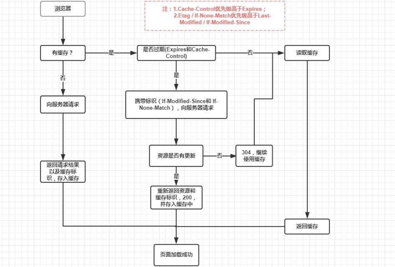

## 1、什么是原型对象、原型链、面向对象、事件、事件冒泡、跨域

js 的数据类型：string number boolean undefined null object
Typeof 返回的类型(都是小写的字符串)
numer
string
function
object
undefined
boolean

instanceof 用于判断引用类型属于哪个构造函数的方法
f instanceof Foo //判断 f 这个引用类型是否属于 Foo 构造函数
arr instanceof Array //true

普通对象和函数对象的区别：凡是通过 new function 创建的对象都是函数对象，其他都是普通对象

构造函数和普通函数的区别：任何函数只要通过 new 来调用，并且一般都是大写字母开头，就可以作为构造函数，反之则为普通函数；

构造函数和实例的区别：
Function Person () {……..}
Var person = new Person();
实例的构造函数属性(constructor)指向的是构造函数（person.constructor === Person）

原型对象：其实原型对象就是对象的 prototype，或者理解为 var A = Person.prototype 那么 A 就是原型对象
所有的原型对象都会自动获取一个 constructor 属性(Person.prototype.constructor === Person)

原型对象都是普通的对象，但是 Function.prototype 除外，它是函数对象，他没有 prototype 属性, 也就是 Function.prototype.prototype = undefined

结论：原型对象是构造函数的一个实例
作用：原型对象的主要作用是用来继承的

+ 原型规则和示例： 
1.所有的引用类型(数组、对象、函数)，都具有对象特性，即可自由扩展属性(除了"null"对象以外) 2.所有引用类型都有一个*proto*(隐式原型)属性，属性值是一个普通的对象 3.所有函数都有一个 prototype(显示原型)属性,属性值也是一个普通对象

原型链就是实例和原型之间存在的一种链接，例如实例的一种属性调用，如果在构造函数上找不到，就去向上在原型对象上找这个属性，一层层的找，知道 null 为止，这样的一种链接就是原型链（Object.prototype.**proto** === null // true）
所有的构造器（内置或者自定义）的*proto*属性都是 Function.prototype

2）面向对象
是用一种抽象方式去创建基于现实世界模型的一种编程方式，特点是封装、继承、多态。（多态：同一操作作用在不同对象身上有不同的结果，也就是说引用类型在不同情况下的不同状态），与之对应的是函数式编程，也就是面向过程，项目越大越难以维护，用一个个函数累计出来的程序

3）事件
指被程序发现的行为或发生的事情，而且它可能会被处理，一般分为用户事件和程序事件
或者说可以被 js 侦测到的行为

DOM 事件流：事件捕获阶段、处于目标阶段、事件冒泡阶段，大部分浏览器现在都支持，更早以前的不支持 dom 事件流

事件的机制：捕获和冒泡
1、阻止默认行为 e.preventDefault()

2、事件冒泡及捕获机制
主要描述当在一个元素上有两个相同类型的事件处理被激活会发生什么？
当一个事件发生在具有父元素的元素上(例如，在我们的例子中是<video>元素)时，现代浏览器运行两个不同的阶段 - 捕获阶段和冒泡阶段

现代浏览器默认情况下所有事件处理程序都在冒泡阶段进行注册，如果想在捕获阶段注册一个事件的话，可以通过 addEventListener() 注册，并且将第三个参数设置为 true
（以前网景只是用事件捕获，Internet Explorer 使用事件冒泡）阻止冒泡行为：e.stopPropagation()
3、事件委托
利用冒泡的原理，把事件加在父级元素身上，从而管理子集的相同事件
例如 ul 元素包裹了许多的 li 元素，个体 ul 加上 click 事件后，点击 li 进行判断就可以了
ul.onclick=function(ev){
var ev = ev || window.event;
Var target = ev.target || ev.srcElement // 后面是 ie，前面是其他浏览器
if( target.nodeName.tolowerCase !== ‘li’){…做一些事情}
}

4、事件处理程序
Dom0 级 就是通常说的 click 等（在冒泡阶段处理，一个 dom 只能注册一个事件，后面的会覆盖前面的）
Dom2 级 addEventListener removeEventlistener（可以为一个 dom 注册多个事件，按照添加的顺序执行，但是 IE 是相反的），接受的参数为事件名（click），处理函数，布尔值，为 true 时在捕获阶段处理，反之在冒泡阶段处理，
IE 事件处理程序用 attachEvent 和 detachEvent，接受两个参数，参数名（onclick）、处理函数，都会被添加到冒泡阶段，所以平时为了兼容布尔值多为 false

4）跨域
原因：浏览器的同源策略导致了跨域，如果没有同源策略的影响，一些机密网站的信息就会非常的危险
```
同源策略限制了一下行为：

- Cookie、LocalStorage 和 IndexDB 无法读取
- DOM 和 JS 对象无法获取
- Ajax 请求发送不出去

      1、因此产生了jsonp JSON with Padding 通过回掉callback函数来给服务端传递数据，jsonp只支持get请求，不支持post
      2、代理的方式解决
      3、CORS，浏览器自动添加头部，如果监测到跨域，服务器端修改后台的头部文件 header(‘Access-Control-Allow-Origin: *’)允许所有来源访问
              Header('Access-Control-Allow-Method: POST,GET')
      4、iframe。另外一端要使用document.domain = ‘study.cn’ 域名（要求主域名相同）
      5、html5中，可以用window.postMessage

  a.html(http://www.nealyang.cn/a.html)
  <iframe id="iframe" src="http://www.neal.cn/b.html" style="display:none;"></iframe>
  <script>       
      var iframe = document.getElementById('iframe');
      iframe. = function() {
          var data = {
              name: 'aym'
          };
          // 向neal传送跨域数据
          iframe.contentWindow.postMessage(JSON.stringify(data), 'http://www.neal.cn');
      };

      // 接受domain2返回数据
      window.addEventListener('message', function(e) {
          alert('data from neal ---> ' + e.data);
      }, false);

  </script>
  b.html(http://www.neal.cn/b.html)
  <script>
      // 接收domain1的数据
      window.addEventListener('message', function(e) {
          alert('data from nealyang ---> ' + e.data);

          var data = JSON.parse(e.data);
          if (data) {
              data.number = 16;

              // 处理后再发回nealyang
              window.parent.postMessage(JSON.stringify(data), 'http://www.nealyang.cn');
          }
      }, false);

  </script>
```

## 5）Vue、React 框架的原理是什么？

React：
设计思想-它并不是一个 MVC 框架，而是一个用于构建组建化的 UI 库，特点是简单直观（声明是的直观编码方式）、组件复用
1）虚拟 DOM
虚拟 DOM 是在 React 中用 JavaScript 重新实现的一个 DOM 模型，和原生的 DOM 并没有多少关系，只是借鉴了原生 DOM 的一些概念，保留了层级结构。

Diff 算法种类：
tree diff
只比较 dom 树的同级节点，如果改变则进行替换
component diff
同一类型的组件指进行同级比较 dom 树即可
同一类型的两个组件，组件 A 变化为组件 B 时，可能 dom 树没有改变，所以用户可通过 shouldComponentUpdate
不同类型的组件，将一个组件判断为 dirty component 脏组件，从而替换整个组件
element diff
当节点处于同一级的时候，提供删除、插入、移动三种方法
2）JSX
使用类似 XML 标记的方式来声明界面及关系，所以他只是一个文档规范
3）Flux
用于配合 React 框架来处理组件和数据之间的交互。简单来说 Flux 就是用于管理数据流。和其他 MVC 框架倡导的双向数据绑定不同，Flux 使用了单向数据绑定的机制，即数据模型到视图的流动

另一种说法：react 是用于用于界面的构建组件化的 UI 库，不同于市面的 MVC 框架，充其量只能是 V 这一层，react 把每个组件当成一个状态起，内部通过 state 来管理状态，当组件的状态发生变化的时候，通过 react 的虚拟 DOM 来高效率的更新真是 DOM

Vue：
MVVM 架构，实现的原理是数据的双向绑定，主要依靠 Observer、Compile、Watcher 三大模块来实现
Observer：能够对数据对象的所有属性进行监听，如有变动可拿到最新值并通知订阅者
Compile：对每个元素节点的指令进行扫描和解析，根据指令模板替换数据，以及绑定相应的更新函数
Watcher：作为连接 Observer 和 Compile 的桥梁，能够订阅并收到每个属性变动的通知，执行指令绑定的相应回调函数，从而更新视图

## 二、
1）js 相关存储
Cookie：4kb 左右，长用于购物车等，同域内请求会带上，浪费宽带，有过期时间，若是删除，将时间设置为过，如果不设置时间，页面关闭就删除，去即可。当设置 httpOnly 为 true 时，是比较安全的，操作直接用 document.cookie。
Session：存储于服务器端的数据，存储特定用户会话的属性及配置信息

Localstroge：能序列化成字符串的内容都可以进行存储，利用 JSON.stringify()；
不能跨域共享，常用 try catch 来判断内存是否满了，存储满后会抛出异常
没有过期时间，需要自己逻辑判断。
SessionStroge：页面关闭后会被清空

方法：setItem getItem removeItem

## 三、算法
1）排序算法之冒泡算法
双循环下，数组中的相邻元素两两比较，然后调换位置，这样最大或最小的就在最右边，然后继续从头两两比较（最后一个不比较）
```
//冒泡排序
function bubbleSort(arr){
  var i = j = 0;
  for(i=1;i<arr.length;i++){
    for(j=0;j<=arr.length-i;j++){
      var temp = 0;
      if(arr[j]>arr[j+1]){
        temp = arr[j];
        arr[j] = arr[j+1];
        arr[j+1] = temp;
      }
    }
  }
}
```

1）排序算法之快速算法
"快速排序"的思想很简单，整个排序过程只需要三步：
（1）在数据集之中，选择一个元素作为"基准"（pivot）。

（2）所有小于"基准"的元素，都移到"基准"的左边；所有大于"基准"的元素，都移到"基准"的右边。

（3）对"基准"左边和右边的两个子集，不断重复第一步和第二步，直到所有子集只剩下一个元素为止。
```
function quickSort(arr, begin, end) {
//递归出口
if(begin >= end)
return;
var l = begin; // 左指针
var r = end; //右指针
var temp = arr[begin]; //基准数，这里取数组第一个数
//左右指针相遇的时候退出扫描循环
while(l < r) {
//右指针从右向左扫描，碰到第一个小于基准数的时候停住
while(l < r && arr[r] >= temp)
r --;
//左指针从左向右扫描，碰到第一个大于基准数的时候停住
while(l < r && arr[l] <= temp)
l ++;
//交换左右指针所停位置的数
[arr[l], arr[r]] = [arr[r], arr[l]];
}
//最后交换基准数与指针相遇位置的数
[arr[begin], arr[l]] = [arr[l], arr[begin]];
//递归处理左右数组
quickSort(arr, begin, l - 1);
quickSort(arr, l + 1, end);
}

       var arr = [2,3,4,1,5,6]
       quickSort(arr, 0, 5);
       console.log(arr)

    var arr = [3, 15, 6, 1];
    console.log(quickSort(arr, 0, arr.length - 1))
```
3）去重方法
利用 key 进行去重，对象键值算法
```
function unique(arr){
var obj = {}
var data = []
for(var i in arr){
if(!obj[arr[i]]){
obj[arr[i]] = true;
data.push(arr[i]);
}
}
return data;
}
排序去重方法
```
## http 协议（浏览器缓存）强缓存和协商缓存
强缓存（本地缓存）
强缓存是利用 http 头中的 Expires 和 Cache-Control 两个字段来控制的，用来表示资源的缓存时间。强缓存中，普通刷新会忽略它，但不会清除它，需要强制刷新。浏览器强制刷新，请求会带上 Cache-Control:no-cache 和 Pragma:no-cache
expires 会被取代的原因是他依靠的是本地（客户端）与服务器的时间做对比，有可能客户端的时间会改变，所以会逐渐被替代，那么优先级肯定就是 Cache-Control 的高了

协商缓存（弱缓存）
由服务器来确定是否可以缓存访问，主要通过以下两个字断进行判断，Last-Modified/If-Modified-Since 和 Etag/If-None-Match
last-modified 是服务器响应的请求时，返回该资源文件在服务器最后被修改的时间
```
// section
流程：

- 首次请求
- 服务器告知启用协商缓存规则，并在响应头中带上 Last-Modified，告知缓存到期时间
- 随后的每次请求，请求头上都会携带 If-Modified-Since，该值等于上一次响应头中的 Last-Modified 的值
- 服务器收到 If-Modified-Since 后，会将该属性的值与服务器上资源的最后修改时间进行匹配，从而判断资源是否发生了变化
- 如果发生变化会返回一个完整的响应内容，在响应头中添加新的 Last-Modified 值，否则，只返回 header 部分，状态码为 304，响应头不会再添加 Last-Modified

弊端: Last-Modified 无法正确感知文件的变化，譬如说，文件的编辑时间修改了而内容没有修改，或者修改文件速度太快，几毫秒就改一次文件，If-Modified-Since 只能检测秒级的变化.
```

为了解决这个问题，Etag 作为 Last-Modified 的升级版，因时而生。

Etag 是通过标识字符串来辨别文件内容是否发生修改的，文件内容不一致才会生成新的标识字符串，这就弥补了 Last-Modified 时间戳的不足，通过 Etag 可以精准的感知文件的变化。

Etag 是服务器响应请求时，返回当前资源文件的一个唯一标识（字符串）
```
// section 2
流程：

- 首次请求
- 服务器启用协商缓存情况下，会在响应头中带上 Etag
- 随后每次请求，请求头上都会带上 If-None-Match，该值等于上一次响应头中的 Etag 的值
- 服务器收到 If-None-Match 后，会进行比对，从而判断资源是否发生变化
- 如果变化返回一个完整响应内容，在响应头上添加新的 Etag 值，否则返回 304,响应头不会在添加 Etag
  弊端: Etag 的生成需要服务器付出额外的开销，会影响服务端性能。

Etag 并不能替代 Last-Modified，只能作为 Last-modified 的补充和强化存在，二者的优先级 Etag 较高
```
整个过程如下图所示


HTTP 的各种请求头含义和作用
Accept： 告诉服务器，客户端接受的数据类型
Host：告诉服务器，客户端想访问的主机名
If-modified-Since：告诉服务器资源的缓存时间
Referer：告诉服务器来自哪个域
Cookie：可以向服务器带数据
Date：告诉服务器请求的时间

响应头：
Server：告诉浏览器服务器的类型
Content-Encoding：告诉浏览器数据采用的压缩方式
Content-type：告诉浏览器回传的数据类型
Refresh：告诉浏览器多长时间刷新一次

2、Http 的几个版本的区别
http/0.9：功能简陋，只支持 get 请求，并且只能访问 html 的资源
http/1.0：相比 0.9 增加了 post 以及 head 的，不极限在 html 资源，可以通过 content-type 支持多种的数据格式，每次请求都会携带 head 信息，除此之外还新增了状态码、权限，缓存等内容，但是 1.0 版本的工作方式是每次 Tcp 的链接只能发送一个请求，当服务器响应后就会关闭这次链接，下一个请求需要在此建立 TCP 链接，不支持 keepalive，

http/1.1：相比于 1.0 最大的变化就是增加了持久链接，即 TCP 默认不关闭，不用声明 connection:keepalive，同时增加了管道机制，一个 TCP 链接里可以发送多个请求，增加并发行，提高效率。新增了 put，delete，pacth

## 3、TCP 三次连接
建立连接（三次握手）
第一次握手：客户端发送 syn 包(seq=x)到服务器，并进入 SYN_SEND 状态，等待服务器确认;
第二次握手：服务器收到 syn 包，必须确认客户的 SYN(ack=x+1)，同时自己也发送一个 SYN 包(seq=y)，即 SYN+ACK 包，此时服务器进入 SYN_RECV 状态;
第三次握手：客户端收到服务器的 SYN+ACK 包，向服务器发送确认包 ACK(ack=y+1)，此包发送完毕，客户端和服务器进入 ESTABLISHED 状态，完成三次握手。
握手过程中传送的包里不包含数据，三次握手完毕后，客户端与服务器才正式开始传送数据。理想状态下，TCP 连接一旦建立，在通信双方中的任何一方主动关闭连接之前，TCP 连接都将被一直保持下去。
传输数据

断开链接（四次挥手）
第一次挥手：主动关闭方发送一个 FIN，用来关闭主动方到被动关闭方的数据传送，也就是主动关闭方告诉被动关闭方：我已经不会再给你发数据了(当 然，在 fin 包之前发送出去的数据，如果没有收到对应的 ack 确认报文，主动关闭方依然会重发这些数据)，但此时主动关闭方还可以接受数据。
第二次挥手：被动关闭方收到 FIN 包后，发送一个 ACK 给对方，确认序号为收到序号+1(与 SYN 相同，一个 FIN 占用一个序号)。
第三次挥手：被动关闭方发送一个 FIN，用来关闭被动关闭方到主动关闭方的数据传送，也就是告诉主动关闭方，我的数据也发送完了，不会再给你发数据了。
第四次挥手：主动关闭方收到 FIN 后，发送一个 ACK 给被动关闭方，确认序号为收到序号+1，至此，完成四次挥手。

【问题 1】为什么连接的时候是三次握手，关闭的时候却是四次握手？

答：因为当 Server 端收到 Client 端的 SYN 连接请求报文后，可以直接发送 SYN+ACK 报文。其中 ACK 报文是用来应答的，SYN 报文是用来同步的。但是关闭连接时，当 Server 端收到 FIN 报文时，很可能并不会立即关闭 SOCKET，所以只能先回复一个 ACK 报文，告诉 Client 端，"你发的 FIN 报文我收到了"。只有等到我 Server 端所有的报文都发送完了，我才能发送 FIN 报文，因此不能一起发送。故需要四步握手。

【问题 2】为什么 TIME_WAIT 状态需要经过 2MSL(最大报文段生存时间)才能返回到 CLOSE 状态？

答：虽然按道理，四个报文都发送完毕，我们可以直接进入 CLOSE 状态了，但是我们必须假象网络是不可靠的，有可以最后一个 ACK 丢失。所以 TIME_WAIT 状态就是用来重发可能丢失的 ACK 报文。在 Client 发送出最后的 ACK 回复，但该 ACK 可能丢失。Server 如果没有收到 ACK，将不断重复发送 FIN 片段。所以 Client 不能立即关闭，它必须确认 Server 接收到了该 ACK。Client 会在发送出 ACK 之后进入到 TIME_WAIT 状态。Client 会设置一个计时器，等待 2MSL 的时间。如果在该时间内再次收到 FIN，那么 Client 会重发 ACK 并再次等待 2MSL。所谓的 2MSL 是两倍的 MSL(Maximum Segment Lifetime)。MSL 指一个片段在网络中最大的存活时间，2MSL 就是一个发送和一个回复所需的最大时间。如果直到 2MSL，Client 都没有再次收到 FIN，那么 Client 推断 ACK 已经被成功接收，则结束 TCP 连接。

【问题 3】为什么不能用两次握手进行连接？

答：3 次握手完成两个重要的功能，既要双方做好发送数据的准备工作(双方都知道彼此已准备好)，也要允许双方就初始序列号进行协商，这个序列号在握手过程中被发送和确认。

       现在把三次握手改成仅需要两次握手，死锁是可能发生的。作为例子，考虑计算机S和C之间的通信，假定C给S发送一个连接请求分组，S收到了这个分组，并发 送了确认应答分组。按照两次握手的协定，S认为连接已经成功地建立了，可以开始发送数据分组。可是，C在S的应答分组在传输中被丢失的情况下，将不知道S 是否已准备好，不知道S建立什么样的序列号，C甚至怀疑S是否收到自己的连接请求分组。在这种情况下，C认为连接还未建立成功，将忽略S发来的任何数据分 组，只等待连接确认应答分组。而S在发出的分组超时后，重复发送同样的分组。这样就形成了死锁。

【问题 4】如果已经建立了连接，但是客户端突然出现故障了怎么办？

TCP 还设有一个保活计时器，显然，客户端如果出现故障，服务器不能一直等下去，白白浪费资源。服务器每收到一次客户端的请求后都会重新复位这个计时器，时间通常是设置为 2 小时，若两小时还没有收到客户端的任何数据，服务器就会发送一个探测报文段，以后每隔 75 分钟发送一次。若一连发送 10 个探测报文仍然没反应，服务器就认为客户端出了故障，接着就关闭连接。

5、Event Loop
所以正确的一次 Event loop 顺序是这样的

1. 执行同步代码，这属于宏任务
2. 执行栈为空，查询是否有微任务需要执行
3. 执行所有微任务
4. 必要的话渲染 UI
5. 然后开始下一轮 Event loop，执行宏任务中的异步代码
   通过上述的 Event loop 顺序可知，如果宏任务中的异步代码有大量的计算并且需要操作 DOM 的话，为了更快的 界面响应，我们可以把操作 DOM 放入微任务中

6、浏览器渲染原理
渲染引擎首先通过网络获取请求的文档内容，然后
解析 html 以构建 dom 树 -> 构建 render 树 -> 布局 render 树 -> 绘制 render 树

构建 dom 树是解析 html 构成树状数据结构和解析 css 构成树状数据结构
render 树是将 html 和 css 两种树融合在一起
layout 树是利用显卡绘制树在屏幕上，也就是 painting 阶段

回流 reflow 和重绘 repaint

改变元素的颜色等不影响几何尺寸的绘制只会发生重绘，改变 layout 的位置会发生回流

## 7、js 运行机制
单线程，遇到异步会放进 task 任务队列里，当执行栈没有任务后就会从 task 任务队列里拿出来放进执行栈中，也就是 EventLoop

8、前端优化终极篇：雅虎 35 条军规


## 1、express和koa的区别？

|  英雄   | 说明  |  对应   | 经典  |
|  ----  | ----  |  ----  | ----  |
| express  | web框架 | es5  | 回调嵌套 |
| koa  | web框架 |es6  | Generator函数+yield语句+Promise |
| koa2  | web框架 |es7  | async/await+Promise |

express用Application、Request、Response、Router四个主要模块，模拟了一个完整的web服务器功能

koa中也包含4个主要模块，Application、Request、Response、Context。此时，router已经被排除在内核之外了，其实，koa只是一个“中间架”，几乎所有的功能都需要由第三方中间件来协同完成。koa使用generator来做相应器，express是回掉函数，这也是最大的区别吧

## 2、var、let、const的区别？
Let块级作用于，只能在它自己的代码块中使用
与var不同，var会变量提升，let不会
全局作用域，函数作用域，块级作用域

## 3、generator和async的区别
generator是一个函数，定义后并不会立即执行，返回的是一个函数对象，只有调用.next()才会获得yield返回的数据，next函数总是会返回一个对象{value:’’, done: false}，布尔值用来表示是否能继续提供返回值
async返回的是一个promise对象，使用.then来获取返回值

async其实就是Generator的语法糖，优势在于内置执行器，直接调用就会返回一个结果，不需要调用.next来返回结果
更广的适用性co模块约定，yield命令后面只能是 Thunk 函数或 Promise 对象，而async函数的await命令后面，可以是 Promise 对象和原始类型的值（数值、字符串和布尔值，但这时会自动转成立即 resolved 的 Promise 对象）

async函数的返回值是 Promise 对象，这比 Generator 函数的返回值是 Iterator（迭代器） 对象方便多了。你可以用then方法指定下一步的操作


## 3、小程序架构的原理
微信小程序的框架包含两部分：View视图层、App Service逻辑层，View层用来渲染页面结构，AppService层用来逻辑处理、数据请求、接口调用，它们在两个进程（两个Webview）里运行。
视图层和逻辑层通过系统层的JSBridage进行通信，逻辑层把数据变化通知到视图层，触发视图层页面更新，视图层把触发的事件通知到逻辑层进行业务处理。


小程序的UI视图和逻辑处理是用多个webview实现的，逻辑处理的JS代码全部加载到一个Webview里面，称之为AppService，整个小程序只有一个，并且整个生命周期常驻内存，而所有的视图（wxml和wxss）都是单独的Webview来承载，称之为AppView。所以一个小程序打开至少就会有2个webview进程，正式因为每个视图都是一个独立的webview进程，考虑到性能消耗，小程序不允许打开超过5个层级的页面，当然同是也是为了体验更好


## 4、window.onload和DomContentloaded和window.onReadyStateChange

window.onload触发的条件页面所有的dom、脚本、图片、flash都加载完毕
DOMContentLoaded是紧当DOM加载完毕后触发

document.onreadystatechange = function() {} 可以根据document.readystate（interactive，complete）来做一些loading效果（不建议用，支持性不太好）

onload事件可以在这些标签中使用，以此来做loading效果body，img，script，link等

script加载js会阻塞html的绘制，遇到了就需要停止去加载js，如果有defer和async这两个属性就不太一样了
defer表示延迟执行引入的js，不会阻止html解析绘制，二者同步进行，在DomContentLoaded之后执行js，当加载多个js的时候，defer是有顺序的加载，async是没有顺序的
async表示异步引入js，没有顺序，可能发生在DomContentLoaded之前或之后执行js，但一定在load触发前执行